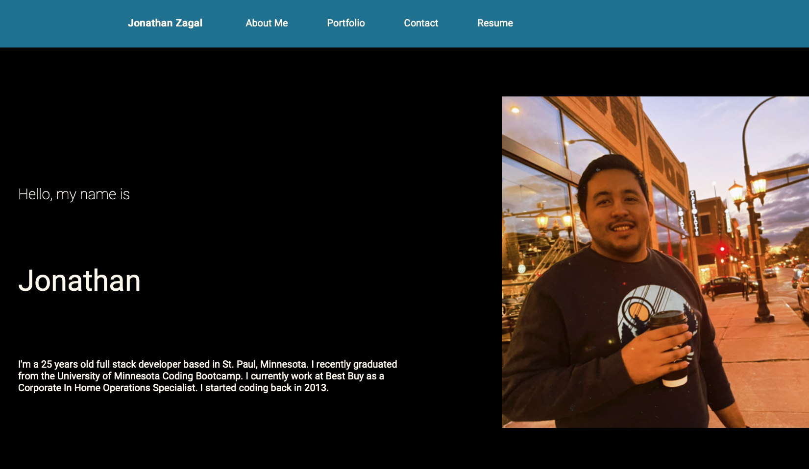

# React Portfolio

---

## Description
This is a personal portfolio with some of my projects, and it was done using react

## Direct Link

[https://zagalj.github.io/ReactPortfolio](https://zagalj.github.io/ReactPortfolio/#Portfolio) 

## Demo 

***

## Table of Contents
* [Installation](#installation)
* [Usage](#usage)
* [Technologies used](#technologies-used)
* [Contributions](#contributions)
* [License](#license)
* [Questions](#questions)

## Installation
npm i, npm run build, npm start

## Usage
Webpage will automatically open your default browser and will show the intro page

## Technologies used

  - CSS
  - Node.js
  - Express.js
  - React

## Contributions
Feel free to reach out by email for any contributions

## License 
Licensed under the MIT License. Copyright © 2022

## Questions
*For any additional questions, you can find me at* 

GitHub: [@ZagalJ](https://github.com/ZagalJ/)

Email: [Jonathan.zagal@hotmail.com](mailto:Jonathan.zagal@hotmail.com)
